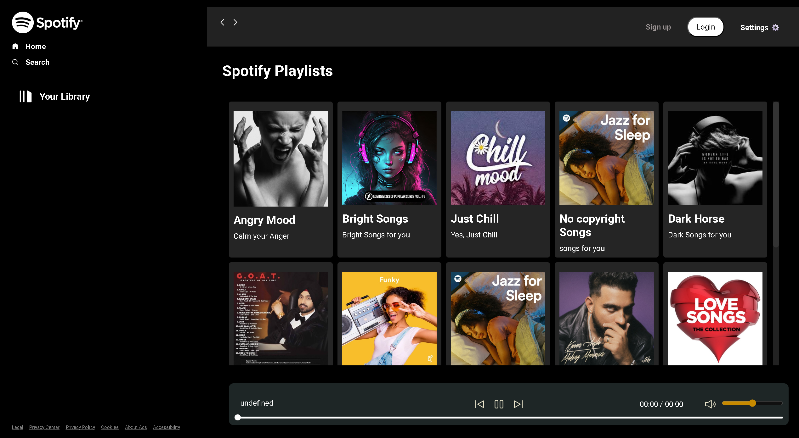

# 🎧 Spotify Clone

**Spotify Clone** is a **web-based music player** that dynamically fetches and plays songs from a local server. Built using **JavaScript**, **HTML**, and **CSS**, this project retrieves available MP3 files, displays them in a user-friendly playlist, and allows seamless playback with intuitive controls.

---

##  Features
- Fetches songs in real-time and dynamically renders them into a playlist  
- ⏯ Play, pause, and resume songs easily  
- ⏮ Skip to the next or previous track  
- ⏭ Seek to different positions in the song  
- Increase and decrease volume smoothly  
- Two themes: **Light** and **Dark** mode for a comfortable listening experience  
- Highly responsive design that adapts to different screen sizes  
- Real-time song progress and duration displayed  
- Interactive and intuitive UI components with visual hover effects  

---
## 📷 Demo Video

[](https://drive.google.com/file/d/1th-eCP1dJz1_7-0zd5W2iP3CxLBkQsje/view?usp=sharing)

> 🎥 Click the thumbnail to view the demo video on Google Drive.

---

## Tech Stack
- **HTML5** — Structure and layout  
- **CSS3** — Styling, responsive design, and theme toggling  
- **JavaScript** — Event handling, Fetch API, DOM manipulation, and audio control  

---

## Future Enhancements
- Search feature to quickly find songs  
- Playlist management  
- Improved UI/UX with additional controls and visualizations  
- Enhanced visual feedback for song status and animations  

---

## Usage
1. Clone this repository:
    ```bash
    git clone https://github.com/your-username/Spotify-clone-new-version.git
    ```
2. Serve the project using a local server (e.g. `Live Server` in VSCode)
3. Open `index.html` in your browser
4. Enjoy listening!

---

**Enjoy your music with Spotify Clone — your lightweight streaming alternative with all the essential player features!** 
